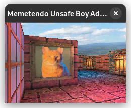
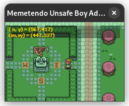
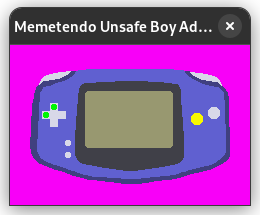

# Memetendo Unsafe Boy Advance

Nothing to see here yet; I'll be working on this in my spare time :)

## Status

Currently passes:
- All of the pre-generated tests in
  [FuzzARM](https://github.com/DenSinH/FuzzARM).
- ARM, THUMB, PPU, memory and BIOS tests in
  [gba-tests](https://github.com/jsmolka/gba-tests).
- [ARMWrestler GBA](https://github.com/destoer/armwrestler-gba-fixed).
- Hello world and invalid condition tests in
  [gba\_tests](https://github.com/destoer/gba_tests).
- Most tests from
  [shonumi/Emu-Docs](https://github.com/shonumi/Emu-Docs/tree/master/GameBoy%20Advance/test_roms).
- Some things from
  [PeterLemon/GBA](https://github.com/PeterLemon/GBA).

## Tests

Run `cargo test` to run tests.  

Some slow tests are ignored by default in debug builds.  
Consider using `cargo test -- --ignored` to run them, or test with optimizations
enabled via `cargo test --release`.

Integration tests exist that automate the running of various test ROMs.  
To set them up, download the submodules in this repository by using
`git submodule update --init` and copy a GBA BIOS ROM to
`/libmemetendo/tests/bios.bin`.

## What's with the name?

## Why Rust and not Zig?

What a very specific question! The vote was very close:

So there was a tie-breaker...

Rustaceans win this time! 🦀
