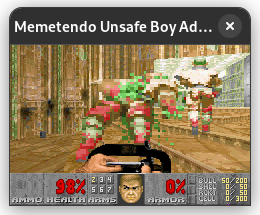
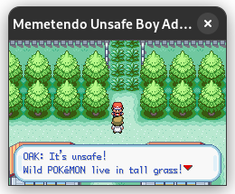
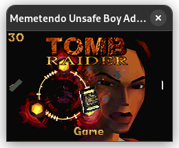
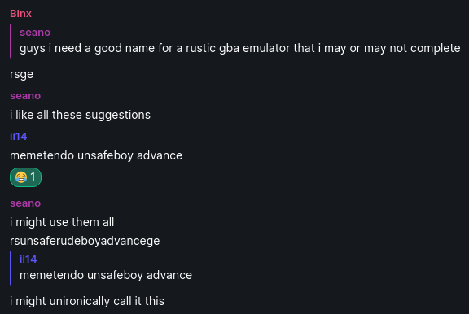
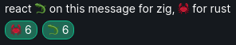
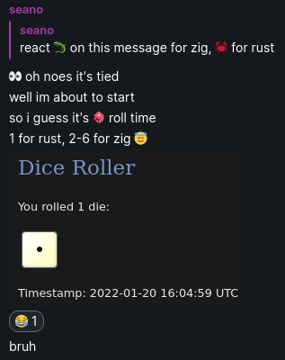

# Memetendo Unsafe Boy Advance

[Try it out in your browser!](https://seandewar.github.io/memetendo-unsafe-boy-advance/)

## Status

Unfinished; I'll be working on this in my spare time (for fun!) :)

It's able to play most games, and has audio support!  
[Here's a video of it running DOOM!](https://www.youtube.com/watch?v=mdFqmEEttws)

As for tests, it currently passes:
- [FuzzARM](https://github.com/DenSinH/FuzzARM).
- Most [gba-tests](https://github.com/jsmolka/gba-tests).
- Most [gba\_tests](https://github.com/destoer/gba_tests).
- [ARMWrestler GBA](https://github.com/destoer/armwrestler-gba-fixed).
- Most tests in [shonumi/Emu-Docs](https://github.com/shonumi/Emu-Docs/tree/master/GameBoy%20Advance/test_roms).
- Most things in [PeterLemon/GBA](https://github.com/PeterLemon/GBA).
- ...and others!

For now, Memetendo Unsafe Boy Advance requires the latest stable Rust compiler
(1.70) to build.

## Tests

Run `cargo test` to run tests.  

Some slow tests are ignored by default in debug builds.  
Consider using `cargo test -- --ignored` to run them, or test with optimizations
enabled via `cargo test --release`.

Integration tests exist that automate the running of various test ROMs.  
To set them up, download the submodules in this repository by using
`git submodule update --init` and copy a GBA BIOS ROM to
`/libmemetendo/tests/bios.bin`.

## Performance

Memetendo Unsafe Boy Advance uses a per-pixel based software renderer, which
allows for graphical effects that modify video state mid-scanline to work, but
performs badly in general.

There's room for optimization, but in the future, I'd like to add a per-scanline
based renderer instead, falling back to the per-pixel based renderer only if
mid-scanline video state changes are detected.

Maybe I'll also consider adding a hardware-accelerated renderer too at some
point? Who knows!

## What's with the name?

And as of writing, Memetendo Unsafe Boy Advance does not actually use any
`unsafe` (non-dependency) code.

## Why Rust and not Zig?

What a very specific question! The vote was very close:

So there was a tie-breaker...

Rustaceans win this time! 🦀
